# Reproducibility & Reblicability survey 2021

## Import packages and data


```python
import pandas as pd
import numpy as np
import matplotlib.pyplot as plt
from matplotlib import rc
import seaborn as sns
```


```python
rr = pd.read_csv('./Reproducibility survey (Responses).csv')
```

## Clean-up


```python
questions = pd.DataFrame({'questions':list(rr.columns)})
questions
```


<div>
<style scoped>
    .dataframe tbody tr th:only-of-type {
        vertical-align: middle;
    }

    .dataframe tbody tr th {
        vertical-align: top;
    }

    .dataframe thead th {
        text-align: right;
    }
</style>
<table border="1" class="dataframe">
  <thead>
    <tr style="text-align: right;">
      <th></th>
      <th>questions</th>
    </tr>
  </thead>
  <tbody>
    <tr>
      <th>0</th>
      <td>Timestamp</td>
    </tr>
    <tr>
      <th>1</th>
      <td>According to you, how important is the Reprodu...</td>
    </tr>
    <tr>
      <th>2</th>
      <td>According to you, how important is the Reprodu...</td>
    </tr>
    <tr>
      <th>3</th>
      <td>According to you, how important is the Reprodu...</td>
    </tr>
    <tr>
      <th>4</th>
      <td>How much do you consider Reproducibility and R...</td>
    </tr>
    <tr>
      <th>5</th>
      <td>Do you publish your code/data/reproducible exa...</td>
    </tr>
    <tr>
      <th>6</th>
      <td>Please tell us what restricts you from publish...</td>
    </tr>
    <tr>
      <th>7</th>
      <td>Tell us which Research Group/Geography Branch ...</td>
    </tr>
    <tr>
      <th>8</th>
      <td>Tell us what you think about R&amp;R. What would h...</td>
    </tr>
  </tbody>
</table>
</div>


```python
rr.columns = ['time','import_your', 'import_depart','import_future','consid_rr','publ','restrict','group','messages']
rr.head()
```


<div>
<style scoped>
    .dataframe tbody tr th:only-of-type {
        vertical-align: middle;
    }

    .dataframe tbody tr th {
        vertical-align: top;
    }

    .dataframe thead th {
        text-align: right;
    }
</style>
<table border="1" class="dataframe">
  <thead>
    <tr style="text-align: right;">
      <th></th>
      <th>time</th>
      <th>import_your</th>
      <th>import_depart</th>
      <th>import_future</th>
      <th>consid_rr</th>
      <th>publ</th>
      <th>restrict</th>
      <th>group</th>
      <th>messages</th>
    </tr>
  </thead>
  <tbody>
    <tr>
      <th>0</th>
      <td>16/03/2021 16:18:13</td>
      <td>Not Important</td>
      <td>Moderately Important</td>
      <td>Slightly Important</td>
      <td>1</td>
      <td>I don't do any of that</td>
      <td>I don't used the scientific method, I am quali...</td>
      <td>Human Geography, Historical and Cultural Resea...</td>
      <td>This is irrelevant for my own branch of geogra...</td>
    </tr>
    <tr>
      <th>1</th>
      <td>17/03/2021 07:06:50</td>
      <td>Important</td>
      <td>Important</td>
      <td>Important</td>
      <td>4</td>
      <td>I don't do any of that</td>
      <td>Lack of skills, tools or knowledge of how to d...</td>
      <td>Human Geography, Political Economy, Quantitati...</td>
      <td>NaN</td>
    </tr>
    <tr>
      <th>2</th>
      <td>17/03/2021 08:20:56</td>
      <td>Very Important</td>
      <td>Very Important</td>
      <td>Very Important</td>
      <td>3</td>
      <td>I don't do any of that</td>
      <td>Lack of skills, tools or knowledge of how to d...</td>
      <td>Physical Geography</td>
      <td>Training on how to do this and what the differ...</td>
    </tr>
    <tr>
      <th>3</th>
      <td>17/03/2021 08:42:44</td>
      <td>Very Important</td>
      <td>Very Important</td>
      <td>Very Important</td>
      <td>4</td>
      <td>Publish preprint on Arxiv, Osf, Eartharxiv, or...</td>
      <td>Lack of skills, tools or knowledge of how to d...</td>
      <td>Physical Geography, Glaciology Centre</td>
      <td>NaN</td>
    </tr>
    <tr>
      <th>4</th>
      <td>16/03/2021 16:20:29</td>
      <td>Very Important</td>
      <td>Very Important</td>
      <td>Very Important</td>
      <td>4</td>
      <td>Publish source code for paper on Github, Rpub,...</td>
      <td>Lack of skills, tools or knowledge of how to d...</td>
      <td>Physical Geography, Research Initiative for th...</td>
      <td>NaN</td>
    </tr>
  </tbody>
</table>
</div>


# Composition of participants


```python
gr = rr.loc[:,['group','consid_rr']]
gr['bin'] =  np.where(gr.group.str.contains("Human"), "H",
                   np.where(gr.group.str.contains("Quantitative"), "H",
                   np.where(gr.group.str.contains("Physical"), "P", "P")))

gr['G'] =  np.where(gr.group.str.contains("Hydrology Group"), "Hydrology Group",
                   np.where(gr.group.str.contains("Glaciology Centre"), "Glaciology Centre",
                    np.where(gr.group.str.contains("Research Initiative for the Dynamic Global"), "Research Initiative for the Dynamic Global Environment",
                    np.where(gr.group.str.contains("Quantitative Spatial Science"), "Quantitative Spatial Science",
                    np.where(gr.group.str.contains("Political Economy"), "Political Economy",
                   np.where(gr.group.str.contains("Historical and Cultural"), "Historical and Cultural Research Group", np.nan))))))

gr1 = gr.loc[:,['bin']].groupby(['bin']).size().reset_index(name ='count')
gr2 = gr.loc[:,['G']].groupby(['G']).size().reset_index(name ='count')
gr1
```


<div>
<style scoped>
    .dataframe tbody tr th:only-of-type {
        vertical-align: middle;
    }

    .dataframe tbody tr th {
        vertical-align: top;
    }

    .dataframe thead th {
        text-align: right;
    }
</style>
<table border="1" class="dataframe">
  <thead>
    <tr style="text-align: right;">
      <th></th>
      <th>bin</th>
      <th>count</th>
    </tr>
  </thead>
  <tbody>
    <tr>
      <th>0</th>
      <td>H</td>
      <td>25</td>
    </tr>
    <tr>
      <th>1</th>
      <td>P</td>
      <td>45</td>
    </tr>
  </tbody>
</table>
</div>


```python
gr
```


<div>
<style scoped>
    .dataframe tbody tr th:only-of-type {
        vertical-align: middle;
    }

    .dataframe tbody tr th {
        vertical-align: top;
    }

    .dataframe thead th {
        text-align: right;
    }
</style>
<table border="1" class="dataframe">
  <thead>
    <tr style="text-align: right;">
      <th></th>
      <th>group</th>
      <th>consid_rr</th>
      <th>bin</th>
      <th>G</th>
    </tr>
  </thead>
  <tbody>
    <tr>
      <th>0</th>
      <td>Human Geography, Historical and Cultural Resea...</td>
      <td>1</td>
      <td>H</td>
      <td>Historical and Cultural Research Group</td>
    </tr>
    <tr>
      <th>1</th>
      <td>Human Geography, Political Economy, Quantitati...</td>
      <td>4</td>
      <td>H</td>
      <td>Quantitative Spatial Science</td>
    </tr>
    <tr>
      <th>2</th>
      <td>Physical Geography</td>
      <td>3</td>
      <td>P</td>
      <td>nan</td>
    </tr>
    <tr>
      <th>3</th>
      <td>Physical Geography, Glaciology Centre</td>
      <td>4</td>
      <td>P</td>
      <td>Glaciology Centre</td>
    </tr>
    <tr>
      <th>4</th>
      <td>Physical Geography, Research Initiative for th...</td>
      <td>4</td>
      <td>P</td>
      <td>Research Initiative for the Dynamic Global Env...</td>
    </tr>
    <tr>
      <th>...</th>
      <td>...</td>
      <td>...</td>
      <td>...</td>
      <td>...</td>
    </tr>
    <tr>
      <th>65</th>
      <td>Human Geography, Political Economy</td>
      <td>1</td>
      <td>H</td>
      <td>Political Economy</td>
    </tr>
    <tr>
      <th>66</th>
      <td>Political Economy</td>
      <td>3</td>
      <td>P</td>
      <td>Political Economy</td>
    </tr>
    <tr>
      <th>67</th>
      <td>Physical Geography, Research Initiative for th...</td>
      <td>4</td>
      <td>P</td>
      <td>Research Initiative for the Dynamic Global Env...</td>
    </tr>
    <tr>
      <th>68</th>
      <td>Human Geography, Political Economy</td>
      <td>1</td>
      <td>H</td>
      <td>Political Economy</td>
    </tr>
    <tr>
      <th>69</th>
      <td>Human Geography</td>
      <td>5</td>
      <td>H</td>
      <td>nan</td>
    </tr>
  </tbody>
</table>
<p>70 rows × 4 columns</p>
</div>


```python
# Create bars and choose color
plt.figure(figsize=(20,5))
j = sns.barplot(x='count', y='bin', data = gr1, palette=sns.color_palette(['cornflowerblue', 'seagreen']))
loc, labels = plt.xticks()
j.set_yticklabels(labels=['Human Geography','Physical Geography'], size = 12)#, rotation=15);
j.set(xlabel='Count', ylabel='Answer')
j.set_title(questions['questions'][7][:-18],size=15, pad = 15)
sns.despine(bottom = True, left = True)

for p in j.patches:
    percentage = '{:.1f}%'.format(100 * p.get_width()/gr1['count'].sum())
    x = p.get_x() + p.get_width() + 0.3
    y = p.get_height() + p.get_y() - 0.3
    j.annotate(percentage, (x, y))
plt.show();


```


    
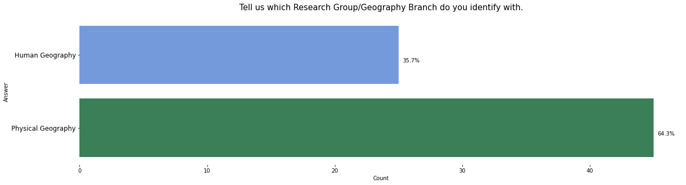
    


```python
# Create bars and choose color
plt.figure(figsize=(20,5))
k = sns.barplot(x='count', y='G', data = gr2, palette=sns.color_palette('Set2'), order=gr2['G'])
k.set(xlabel='Count', ylabel='Answer')
k.set_title(questions['questions'][7][:-18],size=15, pad = 15)
sns.despine(bottom = True, left = True)

for p in k.patches:
    percentage = '{:.1f}%'.format(100 * p.get_width()/gr2['count'].sum())
    x = p.get_x() + p.get_width() + 0.1
    y = p.get_height() + p.get_y() - 0.3
    k.annotate(percentage, (x, y))
plt.show();
```


    
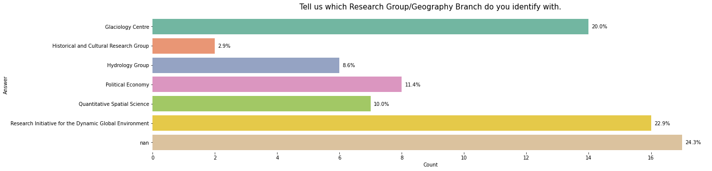
    


# Question N1


```python
im = rr.loc[:,['import_your', 'import_depart','import_future']].melt(id_vars=[],
             var_name="quest",  # rename
             value_name="val")  # rename

im = im.groupby(['quest','val']).size().reset_index(name ='count')
im['quest'] = im['quest'].astype('category')
im['quest'] = im['quest'].cat.reorder_categories(['import_your','import_depart','import_future'])
im['val'] = im['val'].astype('category')
im['val'] = im['val'].cat.reorder_categories([ 'Not Important','Slightly Important','Moderately Important','Important','Very Important',])


rr['bin'] =  np.where(rr.group.str.contains("Human"), "H",
                   np.where(rr.group.str.contains("Quantitative"), "H",
                   np.where(rr.group.str.contains("Physical"), "P", "P")))

im2 = rr.loc[:,['import_your', 'import_depart','import_future', 'bin']].melt(id_vars=['bin'],
             var_name="quest",  # rename
             value_name="val")  # rename

im2 = im2.groupby(['quest','val','bin']).size().reset_index(name ='count')
im2['quest'] = im2['quest'].astype('category')
im2['quest'] = im2['quest'].cat.reorder_categories(['import_your','import_depart','import_future'])
im2['val'] = im2['val'].astype('category')
im2['val'] = im2['val'].cat.reorder_categories([ 'Not Important','Slightly Important','Moderately Important','Important','Very Important',])
```


```python
g = sns.catplot(x="quest", y="count", hue="val", kind="bar", data=im, palette=sns.color_palette("rocket"))
g.set_xticklabels(rotation=30)
g.fig.set_size_inches(15,6)
g.set(xticklabels=['Your own research','Our Department','Future of Geographical research'])
g.set(xlabel='Answer', ylabel='Count')

for ax in g.axes.flat:
    leg = g.axes.flat[0].get_legend()
    if not leg is None: break
# or legend may be on a figure
if leg is None: leg = g._legend

leg.set_title('Value')
g.fig.suptitle(questions['questions'][1][:-20],size=14, y=1.05);
```


    
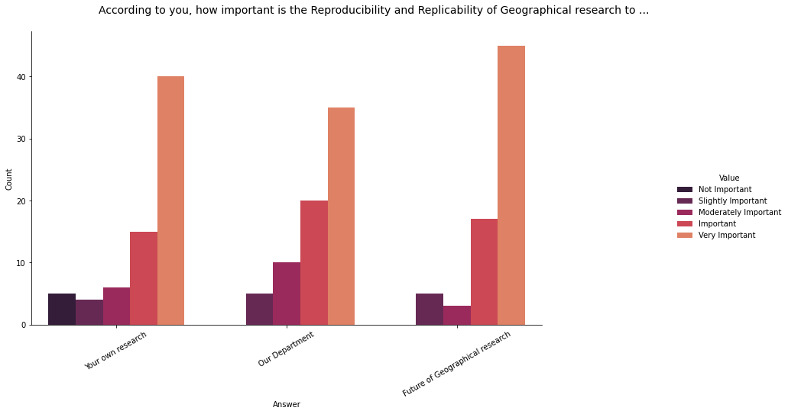
    


```python
im2.head()
```


<div>
<style scoped>
    .dataframe tbody tr th:only-of-type {
        vertical-align: middle;
    }

    .dataframe tbody tr th {
        vertical-align: top;
    }

    .dataframe thead th {
        text-align: right;
    }
</style>
<table border="1" class="dataframe">
  <thead>
    <tr style="text-align: right;">
      <th></th>
      <th>quest</th>
      <th>val</th>
      <th>bin</th>
      <th>count</th>
    </tr>
  </thead>
  <tbody>
    <tr>
      <th>0</th>
      <td>import_depart</td>
      <td>Important</td>
      <td>H</td>
      <td>8</td>
    </tr>
    <tr>
      <th>1</th>
      <td>import_depart</td>
      <td>Important</td>
      <td>P</td>
      <td>12</td>
    </tr>
    <tr>
      <th>2</th>
      <td>import_depart</td>
      <td>Moderately Important</td>
      <td>H</td>
      <td>7</td>
    </tr>
    <tr>
      <th>3</th>
      <td>import_depart</td>
      <td>Moderately Important</td>
      <td>P</td>
      <td>3</td>
    </tr>
    <tr>
      <th>4</th>
      <td>import_depart</td>
      <td>Slightly Important</td>
      <td>H</td>
      <td>2</td>
    </tr>
  </tbody>
</table>
</div>


```python
g = sns.catplot(x="quest", y="count", hue="val", kind="bar", data=im2[im2['bin'] == 'H'], palette=sns.color_palette("PuBu"))
g.set_xticklabels(rotation=30)
g.fig.set_size_inches(15,6)
g.set(xticklabels=['Your own research','Our Department','Future of Geographical research'])
g.set(xlabel='Answer', ylabel='Count')

for ax in g.axes.flat:
    leg = g.axes.flat[0].get_legend()
    if not leg is None: break
# or legend may be on a figure
if leg is None: leg = g._legend

leg.set_title('Value')
#g.fig.suptitle(questions['questions'][1][:-20],size=14, y=1.05)
g.ax.set_title('Human Geography', size =18,  y=1.05);
```


    
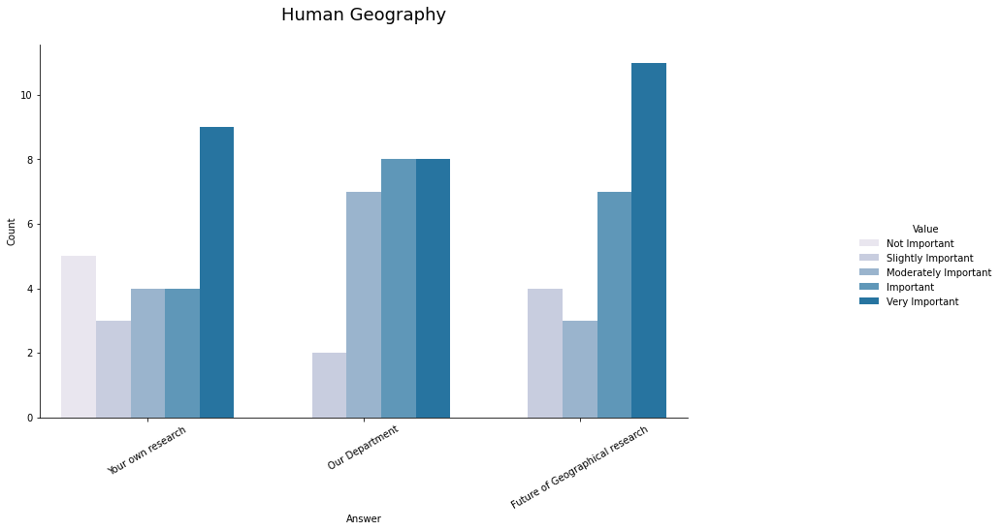
    


```python
g = sns.catplot(x="quest", y="count", hue="val", kind="bar", data=im2[im2['bin'] == 'P'], palette=sns.color_palette("BuGn"))
g.set_xticklabels(rotation=30)
g.fig.set_size_inches(15,6)
g.set(xticklabels=['Your own research','Our Department','Future of Geographical research'])
g.set(xlabel='Answer', ylabel='Count')

for ax in g.axes.flat:
    leg = g.axes.flat[0].get_legend()
    if not leg is None: break
# or legend may be on a figure
if leg is None: leg = g._legend

leg.set_title('Value')
#g.fig.suptitle(questions['questions'][1][:-20],size=14, y=1.05)
g.ax.set_title('Physical Geography', size =18,  y=1.05) ;
```


    
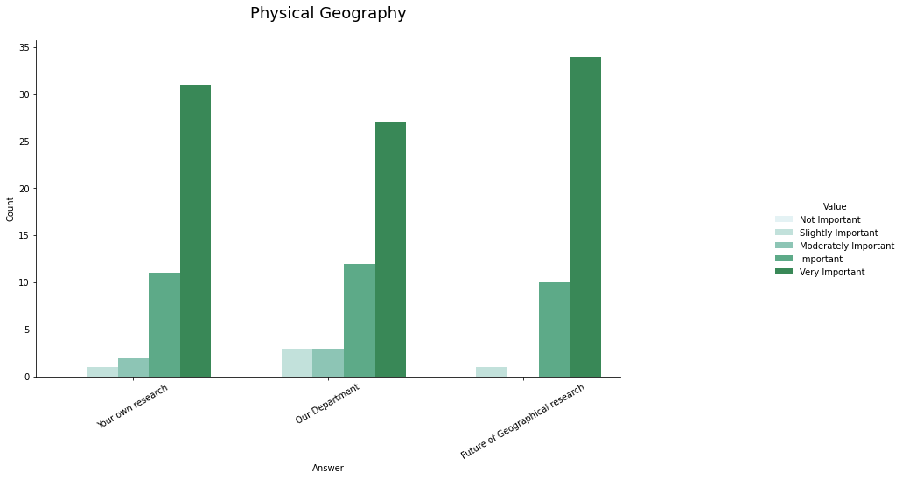
    


# Question N2


```python
cons = rr.loc[:,['consid_rr']].groupby(['consid_rr']).size().reset_index(name ='count')

cons2 =  rr.loc[:,['consid_rr', 'bin']].groupby(['consid_rr','bin']).size().reset_index(name ='count')
```


```python
# Create bars and choose color
plt.figure(figsize=(15,6))
h = sns.barplot(x='consid_rr', y='count', data = cons, palette=sns.color_palette("YlGnBu"))
loc, labels = plt.xticks()
h.set_xticklabels(labels=['Not at all','To a small extent', 'To some extent', 'To a moderate extent','To a great extent'], size = 12)#, rotation=15);
h.set(xlabel='Answer', ylabel='Count')
h.set_title(questions['questions'][4],size=15, pad=15)
sns.despine(bottom = True, left = True)

for p in h.patches:
    percentage = '{:.1f}%'.format(100 * p.get_height()/cons['count'].sum())
    x = p.get_x() + p.get_width() - 0.35
    y = p.get_height() + 0.5
    h.annotate(percentage, (x, y),ha='center')
plt.show();


```


    
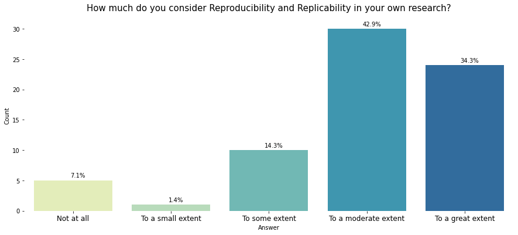
    


```python
cons2
```


<div>
<style scoped>
    .dataframe tbody tr th:only-of-type {
        vertical-align: middle;
    }

    .dataframe tbody tr th {
        vertical-align: top;
    }

    .dataframe thead th {
        text-align: right;
    }
</style>
<table border="1" class="dataframe">
  <thead>
    <tr style="text-align: right;">
      <th></th>
      <th>consid_rr</th>
      <th>bin</th>
      <th>count</th>
    </tr>
  </thead>
  <tbody>
    <tr>
      <th>0</th>
      <td>1</td>
      <td>H</td>
      <td>5</td>
    </tr>
    <tr>
      <th>1</th>
      <td>2</td>
      <td>H</td>
      <td>1</td>
    </tr>
    <tr>
      <th>2</th>
      <td>3</td>
      <td>H</td>
      <td>4</td>
    </tr>
    <tr>
      <th>3</th>
      <td>3</td>
      <td>P</td>
      <td>6</td>
    </tr>
    <tr>
      <th>4</th>
      <td>4</td>
      <td>H</td>
      <td>7</td>
    </tr>
    <tr>
      <th>5</th>
      <td>4</td>
      <td>P</td>
      <td>23</td>
    </tr>
    <tr>
      <th>6</th>
      <td>5</td>
      <td>H</td>
      <td>8</td>
    </tr>
    <tr>
      <th>7</th>
      <td>5</td>
      <td>P</td>
      <td>16</td>
    </tr>
  </tbody>
</table>
</div>


```python
g = sns.catplot(x="bin", y="count", hue="consid_rr", kind="bar", data=cons2, palette=sns.color_palette("YlGnBu"))
#g.set_xticklabels(rotation=30)
g.fig.set_size_inches(15,6)
g.set(xticklabels=['Human Geography','Physical Geography'])
g.set(xlabel='Answer', ylabel='Count')

for ax in g.axes.flat:
    leg = g.axes.flat[0].get_legend()
    if not leg is None: break
# or legend may be on a figure
if leg is None: leg = g._legend

leg.set_title('Value')
g.ax.set_title(questions['questions'][4],size=15, pad=15);
```


    
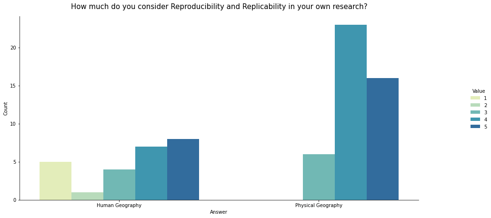
    


```python
gr.loc[:,['bin','consid_rr']]

plt.figure(figsize=(8,8))
j = sns.boxplot(x='consid_rr', y='G', data=gr,  palette=sns.color_palette('Set2'), order=gr2['G'])
j.set(xlabel='Answer', ylabel='Count')
j.set_title(questions['questions'][4],size=15, pad=15)

plt.show()
```


    
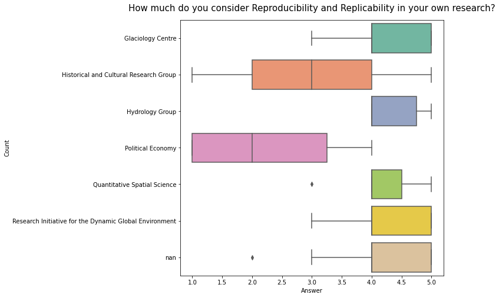
    


```python
gr.loc[:,['group','consid_rr']]

plt.figure(figsize=(8,8))
j = sns.boxplot(x='consid_rr', y='bin', data=gr,  palette=sns.color_palette('Set2'), order=gr1['bin'])
j.set(xlabel='Answer', ylabel='Count')
j.set_title(questions['questions'][4],size=15, pad=15)
j.set_yticklabels(labels=['Human Geography','Physical Geography'], size = 12)

plt.show()
```


    
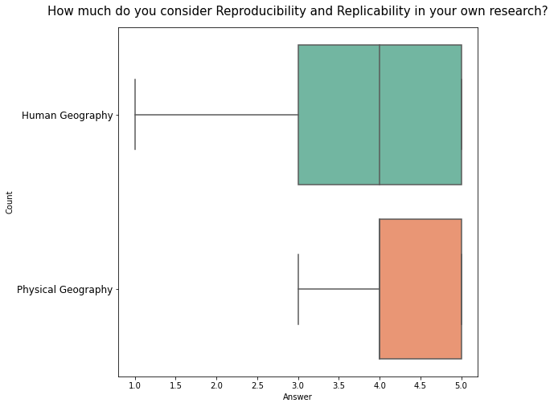
    


# Question N3


```python
pub = rr.loc[:,['publ']]

pub['pre_org'] =  np.where(pub.publ.str.contains("Preregister my research with a preregistration organization"), 1, 0)
pub['pub_pre'] =  np.where(pub.publ.str.contains("Publish preprint on Arxiv, Osf, Eartharxiv, or other distribution service/open-access archive"), 1, 0)
pub['dep'] = np.where(pub.publ.str.contains('Deposit data with data archives such as Figshare, Osf, or with the journal'),1,0)
pub['git'] = np.where(pub.publ.str.contains('Publish source code for paper on Github, Rpub, personal website or other publicly availiable platform'),1,0)
pub['pypi'] = np.where(pub.publ.str.contains('Distribute software package on CRAN, pypi, etc about my research'),1,0)
pub['non'] = np.where(pub.publ.str.contains("I don't do any of that"),1,0)

pub['sum'] = pub.pre_org + pub.pub_pre + pub.dep + pub.git + pub.pypi + pub.non
pub['o1'] = np.where(pub['sum'] < 1,1,0)

#pub['o2'] = np.where(pub.publ.str.contains("I hav"),1,0)

pub
```


<div>
<style scoped>
    .dataframe tbody tr th:only-of-type {
        vertical-align: middle;
    }

    .dataframe tbody tr th {
        vertical-align: top;
    }

    .dataframe thead th {
        text-align: right;
    }
</style>
<table border="1" class="dataframe">
  <thead>
    <tr style="text-align: right;">
      <th></th>
      <th>publ</th>
      <th>pre_org</th>
      <th>pub_pre</th>
      <th>dep</th>
      <th>git</th>
      <th>pypi</th>
      <th>non</th>
      <th>sum</th>
      <th>o1</th>
    </tr>
  </thead>
  <tbody>
    <tr>
      <th>0</th>
      <td>I don't do any of that</td>
      <td>0</td>
      <td>0</td>
      <td>0</td>
      <td>0</td>
      <td>0</td>
      <td>1</td>
      <td>1</td>
      <td>0</td>
    </tr>
    <tr>
      <th>1</th>
      <td>I don't do any of that</td>
      <td>0</td>
      <td>0</td>
      <td>0</td>
      <td>0</td>
      <td>0</td>
      <td>1</td>
      <td>1</td>
      <td>0</td>
    </tr>
    <tr>
      <th>2</th>
      <td>I don't do any of that</td>
      <td>0</td>
      <td>0</td>
      <td>0</td>
      <td>0</td>
      <td>0</td>
      <td>1</td>
      <td>1</td>
      <td>0</td>
    </tr>
    <tr>
      <th>3</th>
      <td>Publish preprint on Arxiv, Osf, Eartharxiv, or...</td>
      <td>0</td>
      <td>1</td>
      <td>0</td>
      <td>0</td>
      <td>0</td>
      <td>0</td>
      <td>1</td>
      <td>0</td>
    </tr>
    <tr>
      <th>4</th>
      <td>Publish source code for paper on Github, Rpub,...</td>
      <td>0</td>
      <td>0</td>
      <td>0</td>
      <td>1</td>
      <td>0</td>
      <td>0</td>
      <td>1</td>
      <td>0</td>
    </tr>
    <tr>
      <th>...</th>
      <td>...</td>
      <td>...</td>
      <td>...</td>
      <td>...</td>
      <td>...</td>
      <td>...</td>
      <td>...</td>
      <td>...</td>
      <td>...</td>
    </tr>
    <tr>
      <th>65</th>
      <td>I don't do any of that</td>
      <td>0</td>
      <td>0</td>
      <td>0</td>
      <td>0</td>
      <td>0</td>
      <td>1</td>
      <td>1</td>
      <td>0</td>
    </tr>
    <tr>
      <th>66</th>
      <td>I don't do any of that</td>
      <td>0</td>
      <td>0</td>
      <td>0</td>
      <td>0</td>
      <td>0</td>
      <td>1</td>
      <td>1</td>
      <td>0</td>
    </tr>
    <tr>
      <th>67</th>
      <td>Publish preprint on Arxiv, Osf, Eartharxiv, or...</td>
      <td>0</td>
      <td>1</td>
      <td>1</td>
      <td>1</td>
      <td>0</td>
      <td>0</td>
      <td>3</td>
      <td>0</td>
    </tr>
    <tr>
      <th>68</th>
      <td>I don't do any of that</td>
      <td>0</td>
      <td>0</td>
      <td>0</td>
      <td>0</td>
      <td>0</td>
      <td>1</td>
      <td>1</td>
      <td>0</td>
    </tr>
    <tr>
      <th>69</th>
      <td>I don't do any of that</td>
      <td>0</td>
      <td>0</td>
      <td>0</td>
      <td>0</td>
      <td>0</td>
      <td>1</td>
      <td>1</td>
      <td>0</td>
    </tr>
  </tbody>
</table>
<p>70 rows × 9 columns</p>
</div>


```python
x = pub.iloc[:,[1,2,3,4,5,6,8]]
x.loc[:,['pre_org']].groupby(['pre_org']).size().reset_index(name ='count').rename(columns ={'pre_org':'var'})
```


<div>
<style scoped>
    .dataframe tbody tr th:only-of-type {
        vertical-align: middle;
    }

    .dataframe tbody tr th {
        vertical-align: top;
    }

    .dataframe thead th {
        text-align: right;
    }
</style>
<table border="1" class="dataframe">
  <thead>
    <tr style="text-align: right;">
      <th></th>
      <th>var</th>
      <th>count</th>
    </tr>
  </thead>
  <tbody>
    <tr>
      <th>0</th>
      <td>0</td>
      <td>68</td>
    </tr>
    <tr>
      <th>1</th>
      <td>1</td>
      <td>2</td>
    </tr>
  </tbody>
</table>
</div>


```python
x
```


<div>
<style scoped>
    .dataframe tbody tr th:only-of-type {
        vertical-align: middle;
    }

    .dataframe tbody tr th {
        vertical-align: top;
    }

    .dataframe thead th {
        text-align: right;
    }
</style>
<table border="1" class="dataframe">
  <thead>
    <tr style="text-align: right;">
      <th></th>
      <th>pre_org</th>
      <th>pub_pre</th>
      <th>dep</th>
      <th>git</th>
      <th>pypi</th>
      <th>non</th>
      <th>o1</th>
    </tr>
  </thead>
  <tbody>
    <tr>
      <th>0</th>
      <td>0</td>
      <td>0</td>
      <td>0</td>
      <td>0</td>
      <td>0</td>
      <td>1</td>
      <td>0</td>
    </tr>
    <tr>
      <th>1</th>
      <td>0</td>
      <td>0</td>
      <td>0</td>
      <td>0</td>
      <td>0</td>
      <td>1</td>
      <td>0</td>
    </tr>
    <tr>
      <th>2</th>
      <td>0</td>
      <td>0</td>
      <td>0</td>
      <td>0</td>
      <td>0</td>
      <td>1</td>
      <td>0</td>
    </tr>
    <tr>
      <th>3</th>
      <td>0</td>
      <td>1</td>
      <td>0</td>
      <td>0</td>
      <td>0</td>
      <td>0</td>
      <td>0</td>
    </tr>
    <tr>
      <th>4</th>
      <td>0</td>
      <td>0</td>
      <td>0</td>
      <td>1</td>
      <td>0</td>
      <td>0</td>
      <td>0</td>
    </tr>
    <tr>
      <th>...</th>
      <td>...</td>
      <td>...</td>
      <td>...</td>
      <td>...</td>
      <td>...</td>
      <td>...</td>
      <td>...</td>
    </tr>
    <tr>
      <th>65</th>
      <td>0</td>
      <td>0</td>
      <td>0</td>
      <td>0</td>
      <td>0</td>
      <td>1</td>
      <td>0</td>
    </tr>
    <tr>
      <th>66</th>
      <td>0</td>
      <td>0</td>
      <td>0</td>
      <td>0</td>
      <td>0</td>
      <td>1</td>
      <td>0</td>
    </tr>
    <tr>
      <th>67</th>
      <td>0</td>
      <td>1</td>
      <td>1</td>
      <td>1</td>
      <td>0</td>
      <td>0</td>
      <td>0</td>
    </tr>
    <tr>
      <th>68</th>
      <td>0</td>
      <td>0</td>
      <td>0</td>
      <td>0</td>
      <td>0</td>
      <td>1</td>
      <td>0</td>
    </tr>
    <tr>
      <th>69</th>
      <td>0</td>
      <td>0</td>
      <td>0</td>
      <td>0</td>
      <td>0</td>
      <td>1</td>
      <td>0</td>
    </tr>
  </tbody>
</table>
<p>70 rows × 7 columns</p>
</div>


```python
x = pub.iloc[:,[1,2,3,4,5,6,8]]

sums = pd.DataFrame()

for col in list(x.columns):
    df = x.loc[:,[col]].groupby([col]).size().reset_index(name ='count').rename(columns ={col:'bin'})
    df['var'] = col
    sums = pd.concat([sums,df])
    print('done')
```

    done
    done
    done
    done
    done
    done
    done
    


```python
sums = sums.reset_index(drop=True)
sums
```


<div>
<style scoped>
    .dataframe tbody tr th:only-of-type {
        vertical-align: middle;
    }

    .dataframe tbody tr th {
        vertical-align: top;
    }

    .dataframe thead th {
        text-align: right;
    }
</style>
<table border="1" class="dataframe">
  <thead>
    <tr style="text-align: right;">
      <th></th>
      <th>bin</th>
      <th>count</th>
      <th>var</th>
    </tr>
  </thead>
  <tbody>
    <tr>
      <th>0</th>
      <td>0</td>
      <td>68</td>
      <td>pre_org</td>
    </tr>
    <tr>
      <th>1</th>
      <td>1</td>
      <td>2</td>
      <td>pre_org</td>
    </tr>
    <tr>
      <th>2</th>
      <td>0</td>
      <td>54</td>
      <td>pub_pre</td>
    </tr>
    <tr>
      <th>3</th>
      <td>1</td>
      <td>16</td>
      <td>pub_pre</td>
    </tr>
    <tr>
      <th>4</th>
      <td>0</td>
      <td>41</td>
      <td>dep</td>
    </tr>
    <tr>
      <th>5</th>
      <td>1</td>
      <td>29</td>
      <td>dep</td>
    </tr>
    <tr>
      <th>6</th>
      <td>0</td>
      <td>41</td>
      <td>git</td>
    </tr>
    <tr>
      <th>7</th>
      <td>1</td>
      <td>29</td>
      <td>git</td>
    </tr>
    <tr>
      <th>8</th>
      <td>0</td>
      <td>66</td>
      <td>pypi</td>
    </tr>
    <tr>
      <th>9</th>
      <td>1</td>
      <td>4</td>
      <td>pypi</td>
    </tr>
    <tr>
      <th>10</th>
      <td>0</td>
      <td>46</td>
      <td>non</td>
    </tr>
    <tr>
      <th>11</th>
      <td>1</td>
      <td>24</td>
      <td>non</td>
    </tr>
    <tr>
      <th>12</th>
      <td>0</td>
      <td>67</td>
      <td>o1</td>
    </tr>
    <tr>
      <th>13</th>
      <td>1</td>
      <td>3</td>
      <td>o1</td>
    </tr>
  </tbody>
</table>
</div>


```python
list_perc = []

list_perc.append(round(100 * ( sums.iloc[0]['count']/sums.iloc[0:2]['count'].sum()  ),1)) 
list_perc.append(round(100 * ( sums.iloc[1]['count']/sums.iloc[0:2]['count'].sum()  ),1))  

list_perc.append(round(100 * ( sums.iloc[2]['count']/sums.iloc[2:4]['count'].sum()  ),1))  
list_perc.append(round(100 * ( sums.iloc[3]['count']/sums.iloc[2:4]['count'].sum()  ),1))  

list_perc.append(round(100 * ( sums.iloc[4]['count']/sums.iloc[4:6]['count'].sum()  ),1))  
list_perc.append(round(100 * ( sums.iloc[5]['count']/sums.iloc[4:6]['count'].sum()  ),1))  

list_perc.append(round(100 * ( sums.iloc[6]['count']/sums.iloc[6:8]['count'].sum()  ),1))  
list_perc.append(round(100 * ( sums.iloc[7]['count']/sums.iloc[6:8]['count'].sum()  ),1))  

list_perc.append(round(100 * ( sums.iloc[8]['count']/sums.iloc[8:10]['count'].sum()  ),1))  
list_perc.append(round(100 * ( sums.iloc[9]['count']/sums.iloc[8:10]['count'].sum()  ),1))  

list_perc.append(round(100 * ( sums.iloc[10]['count']/sums.iloc[10:12]['count'].sum()  ),1))  
list_perc.append(round(100 * ( sums.iloc[11]['count']/sums.iloc[10:12]['count'].sum()  ),1))  

list_perc.append(round(100 * ( sums.iloc[12]['count']/sums.iloc[12:14]['count'].sum()  ),1))  
list_perc.append(round(100 * ( sums.iloc[13]['count']/sums.iloc[12:14]['count'].sum()  ),1))  

sums['perc'] = pd.Series(list_perc)
sums
```


<div>
<style scoped>
    .dataframe tbody tr th:only-of-type {
        vertical-align: middle;
    }

    .dataframe tbody tr th {
        vertical-align: top;
    }

    .dataframe thead th {
        text-align: right;
    }
</style>
<table border="1" class="dataframe">
  <thead>
    <tr style="text-align: right;">
      <th></th>
      <th>bin</th>
      <th>count</th>
      <th>var</th>
      <th>perc</th>
    </tr>
  </thead>
  <tbody>
    <tr>
      <th>0</th>
      <td>0</td>
      <td>68</td>
      <td>pre_org</td>
      <td>97.1</td>
    </tr>
    <tr>
      <th>1</th>
      <td>1</td>
      <td>2</td>
      <td>pre_org</td>
      <td>2.9</td>
    </tr>
    <tr>
      <th>2</th>
      <td>0</td>
      <td>54</td>
      <td>pub_pre</td>
      <td>77.1</td>
    </tr>
    <tr>
      <th>3</th>
      <td>1</td>
      <td>16</td>
      <td>pub_pre</td>
      <td>22.9</td>
    </tr>
    <tr>
      <th>4</th>
      <td>0</td>
      <td>41</td>
      <td>dep</td>
      <td>58.6</td>
    </tr>
    <tr>
      <th>5</th>
      <td>1</td>
      <td>29</td>
      <td>dep</td>
      <td>41.4</td>
    </tr>
    <tr>
      <th>6</th>
      <td>0</td>
      <td>41</td>
      <td>git</td>
      <td>58.6</td>
    </tr>
    <tr>
      <th>7</th>
      <td>1</td>
      <td>29</td>
      <td>git</td>
      <td>41.4</td>
    </tr>
    <tr>
      <th>8</th>
      <td>0</td>
      <td>66</td>
      <td>pypi</td>
      <td>94.3</td>
    </tr>
    <tr>
      <th>9</th>
      <td>1</td>
      <td>4</td>
      <td>pypi</td>
      <td>5.7</td>
    </tr>
    <tr>
      <th>10</th>
      <td>0</td>
      <td>46</td>
      <td>non</td>
      <td>65.7</td>
    </tr>
    <tr>
      <th>11</th>
      <td>1</td>
      <td>24</td>
      <td>non</td>
      <td>34.3</td>
    </tr>
    <tr>
      <th>12</th>
      <td>0</td>
      <td>67</td>
      <td>o1</td>
      <td>95.7</td>
    </tr>
    <tr>
      <th>13</th>
      <td>1</td>
      <td>3</td>
      <td>o1</td>
      <td>4.3</td>
    </tr>
  </tbody>
</table>
</div>


```python
list(sums['perc'])
```


    [97.1,
     2.9,
     77.1,
     22.9,
     58.6,
     41.4,
     58.6,
     41.4,
     94.3,
     5.7,
     65.7,
     34.3,
     95.7,
     4.3]


```python
[97.1,77.1,58.6,58.6,94.3, 65.7, 95.7,
 2.9,22.9,41.4,41.4, 5.7,34.3, 4.3]
```


    [97.1,
     77.1,
     58.6,
     58.6,
     94.3,
     65.7,
     95.7,
     2.9,
     22.9,
     41.4,
     41.4,
     5.7,
     34.3,
     4.3]


```python
l = sns.catplot(x="count", y="var", hue="bin", kind="bar", data=sums, palette=sns.color_palette(['lavender','orangered']))
l.fig.set_size_inches(10,7)
l.set(yticklabels=["Preregister my research with a preregistration organization",
                   "Publish preprint on Arxiv, Osf, Eartharxiv, or other distribution service/open-access archive",
                   'Deposit data with data archives such as Figshare, Osf, or with the journal',
                   'Publish source code for paper on Github, Rpub, personal website or other publicly availiable platform',
                   'Distribute software package on CRAN, pypi, etc about my research',"I don't do any of that",'Other'])
l.set(ylabel='Answer', xlabel='Count')
l.fig.suptitle(questions['questions'][5][:-18],size=14, y=1.06)
l.ax.tick_params(labelsize=11)

li = [97.1,77.1,58.6,58.6,94.3, 65.7, 95.7,
 2.9,22.9,41.4,41.4, 5.7,34.3, 4.3]

for p,i in zip(l.ax.patches,li):
    width = p.get_width()    # get bar length
    l.ax.text(width + 1,       # set the text at 1 unit right of the bar
            p.get_y() + p.get_height() / 2, # get Y coordinate + X coordinate / 2
            '{:1.2f}%'.format(i), # set variable to display, 2 decimals
            ha = 'left',   # horizontal alignment
            va = 'center', size = 11)  # vertical alignment


for ax in l.axes.flat:
    leg = l.axes.flat[0].get_legend()
    if not leg is None: break
# or legend may be on a figure
if leg is None: leg = l._legend

leg.set_title('Value')
new_labels = ['No', 'Yes']
for t, l in zip(leg.texts, new_labels): t.set_text(l)
    

    
plt.show();
```


    
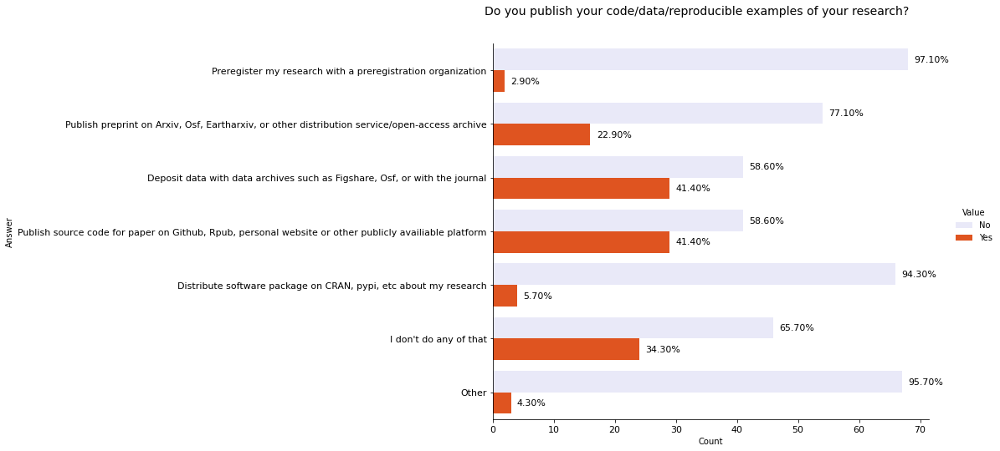
    


# Question N4


```python
#restrict

res = rr.loc[:,['restrict']]

res['no'] =  np.where(res.restrict.str.contains("No restrictions"), 1, 0)
res['sens'] =  np.where(res.restrict.str.contains("Sensitive research/data"), 1, 0)
res['lack'] = np.where(res.restrict.str.contains('Lack of skills, tools or knowledge of how to do that'),1,0)
res['peer'] = np.where(res.restrict.str.contains('peers'),1,0)
res['time'] = np.where(res.restrict.str.contains('time'),1,0)

res['sum'] = res.no + res.sens +res.lack +res.peer +res.time
res['o1'] = np.where(res['sum'] < 1,1,0)

res
```


<div>
<style scoped>
    .dataframe tbody tr th:only-of-type {
        vertical-align: middle;
    }

    .dataframe tbody tr th {
        vertical-align: top;
    }

    .dataframe thead th {
        text-align: right;
    }
</style>
<table border="1" class="dataframe">
  <thead>
    <tr style="text-align: right;">
      <th></th>
      <th>restrict</th>
      <th>no</th>
      <th>sens</th>
      <th>lack</th>
      <th>peer</th>
      <th>time</th>
      <th>sum</th>
      <th>o1</th>
    </tr>
  </thead>
  <tbody>
    <tr>
      <th>0</th>
      <td>I don't used the scientific method, I am quali...</td>
      <td>0</td>
      <td>0</td>
      <td>0</td>
      <td>0</td>
      <td>0</td>
      <td>0</td>
      <td>1</td>
    </tr>
    <tr>
      <th>1</th>
      <td>Lack of skills, tools or knowledge of how to d...</td>
      <td>0</td>
      <td>0</td>
      <td>1</td>
      <td>0</td>
      <td>0</td>
      <td>1</td>
      <td>0</td>
    </tr>
    <tr>
      <th>2</th>
      <td>Lack of skills, tools or knowledge of how to d...</td>
      <td>0</td>
      <td>0</td>
      <td>1</td>
      <td>0</td>
      <td>0</td>
      <td>1</td>
      <td>0</td>
    </tr>
    <tr>
      <th>3</th>
      <td>Lack of skills, tools or knowledge of how to d...</td>
      <td>0</td>
      <td>0</td>
      <td>1</td>
      <td>0</td>
      <td>0</td>
      <td>1</td>
      <td>0</td>
    </tr>
    <tr>
      <th>4</th>
      <td>Lack of skills, tools or knowledge of how to d...</td>
      <td>0</td>
      <td>0</td>
      <td>1</td>
      <td>0</td>
      <td>0</td>
      <td>1</td>
      <td>0</td>
    </tr>
    <tr>
      <th>...</th>
      <td>...</td>
      <td>...</td>
      <td>...</td>
      <td>...</td>
      <td>...</td>
      <td>...</td>
      <td>...</td>
      <td>...</td>
    </tr>
    <tr>
      <th>65</th>
      <td>No restrictions</td>
      <td>1</td>
      <td>0</td>
      <td>0</td>
      <td>0</td>
      <td>0</td>
      <td>1</td>
      <td>0</td>
    </tr>
    <tr>
      <th>66</th>
      <td>Lack of skills, tools or knowledge of how to d...</td>
      <td>0</td>
      <td>0</td>
      <td>1</td>
      <td>0</td>
      <td>0</td>
      <td>1</td>
      <td>0</td>
    </tr>
    <tr>
      <th>67</th>
      <td>Lack of skills, tools or knowledge of how to d...</td>
      <td>0</td>
      <td>0</td>
      <td>1</td>
      <td>0</td>
      <td>0</td>
      <td>1</td>
      <td>0</td>
    </tr>
    <tr>
      <th>68</th>
      <td>Sensitive research/data</td>
      <td>0</td>
      <td>1</td>
      <td>0</td>
      <td>0</td>
      <td>0</td>
      <td>1</td>
      <td>0</td>
    </tr>
    <tr>
      <th>69</th>
      <td>Lack of skills, tools or knowledge of how to d...</td>
      <td>0</td>
      <td>0</td>
      <td>1</td>
      <td>0</td>
      <td>0</td>
      <td>1</td>
      <td>0</td>
    </tr>
  </tbody>
</table>
<p>70 rows × 8 columns</p>
</div>


```python
y = res.iloc[:,[1,2,3,4,5,7]]

resu = pd.DataFrame()

for col in list(y.columns):
    df = y.loc[:,[col]].groupby([col]).size().reset_index(name ='count').rename(columns ={col:'bin'})
    df['var'] = col
    resu = pd.concat([resu,df])
    print('done')
```

    done
    done
    done
    done
    done
    done
    


```python
resu = resu.reset_index(drop=True)
resu
```


<div>
<style scoped>
    .dataframe tbody tr th:only-of-type {
        vertical-align: middle;
    }

    .dataframe tbody tr th {
        vertical-align: top;
    }

    .dataframe thead th {
        text-align: right;
    }
</style>
<table border="1" class="dataframe">
  <thead>
    <tr style="text-align: right;">
      <th></th>
      <th>bin</th>
      <th>count</th>
      <th>var</th>
    </tr>
  </thead>
  <tbody>
    <tr>
      <th>0</th>
      <td>0</td>
      <td>52</td>
      <td>no</td>
    </tr>
    <tr>
      <th>1</th>
      <td>1</td>
      <td>18</td>
      <td>no</td>
    </tr>
    <tr>
      <th>2</th>
      <td>0</td>
      <td>51</td>
      <td>sens</td>
    </tr>
    <tr>
      <th>3</th>
      <td>1</td>
      <td>19</td>
      <td>sens</td>
    </tr>
    <tr>
      <th>4</th>
      <td>0</td>
      <td>45</td>
      <td>lack</td>
    </tr>
    <tr>
      <th>5</th>
      <td>1</td>
      <td>25</td>
      <td>lack</td>
    </tr>
    <tr>
      <th>6</th>
      <td>0</td>
      <td>64</td>
      <td>peer</td>
    </tr>
    <tr>
      <th>7</th>
      <td>1</td>
      <td>6</td>
      <td>peer</td>
    </tr>
    <tr>
      <th>8</th>
      <td>0</td>
      <td>46</td>
      <td>time</td>
    </tr>
    <tr>
      <th>9</th>
      <td>1</td>
      <td>24</td>
      <td>time</td>
    </tr>
    <tr>
      <th>10</th>
      <td>0</td>
      <td>66</td>
      <td>o1</td>
    </tr>
    <tr>
      <th>11</th>
      <td>1</td>
      <td>4</td>
      <td>o1</td>
    </tr>
  </tbody>
</table>
</div>


```python
list_resu = []

list_resu.append(round(100 * ( resu.iloc[0]['count']/resu.iloc[0:2]['count'].sum()  ),1)) 
list_resu.append(round(100 * ( resu.iloc[1]['count']/resu.iloc[0:2]['count'].sum()  ),1))  

list_resu.append(round(100 * ( resu.iloc[2]['count']/resu.iloc[2:4]['count'].sum()  ),1))  
list_resu.append(round(100 * ( resu.iloc[3]['count']/resu.iloc[2:4]['count'].sum()  ),1))  

list_resu.append(round(100 * ( resu.iloc[4]['count']/resu.iloc[4:6]['count'].sum()  ),1))  
list_resu.append(round(100 * ( resu.iloc[5]['count']/resu.iloc[4:6]['count'].sum()  ),1))  

list_resu.append(round(100 * ( resu.iloc[6]['count']/resu.iloc[6:8]['count'].sum()  ),1))  
list_resu.append(round(100 * ( resu.iloc[7]['count']/resu.iloc[6:8]['count'].sum()  ),1))  

list_resu.append(round(100 * ( resu.iloc[8]['count']/resu.iloc[8:10]['count'].sum()  ),1))  
list_resu.append(round(100 * ( resu.iloc[9]['count']/resu.iloc[8:10]['count'].sum()  ),1))  

list_resu.append(round(100 * ( resu.iloc[10]['count']/resu.iloc[10:12]['count'].sum()  ),1))  
list_resu.append(round(100 * ( resu.iloc[11]['count']/resu.iloc[10:12]['count'].sum()  ),1))  


resu['perc'] = pd.Series(list_resu)
resu
```


<div>
<style scoped>
    .dataframe tbody tr th:only-of-type {
        vertical-align: middle;
    }

    .dataframe tbody tr th {
        vertical-align: top;
    }

    .dataframe thead th {
        text-align: right;
    }
</style>
<table border="1" class="dataframe">
  <thead>
    <tr style="text-align: right;">
      <th></th>
      <th>bin</th>
      <th>count</th>
      <th>var</th>
      <th>perc</th>
    </tr>
  </thead>
  <tbody>
    <tr>
      <th>0</th>
      <td>0</td>
      <td>52</td>
      <td>no</td>
      <td>74.3</td>
    </tr>
    <tr>
      <th>1</th>
      <td>1</td>
      <td>18</td>
      <td>no</td>
      <td>25.7</td>
    </tr>
    <tr>
      <th>2</th>
      <td>0</td>
      <td>51</td>
      <td>sens</td>
      <td>72.9</td>
    </tr>
    <tr>
      <th>3</th>
      <td>1</td>
      <td>19</td>
      <td>sens</td>
      <td>27.1</td>
    </tr>
    <tr>
      <th>4</th>
      <td>0</td>
      <td>45</td>
      <td>lack</td>
      <td>64.3</td>
    </tr>
    <tr>
      <th>5</th>
      <td>1</td>
      <td>25</td>
      <td>lack</td>
      <td>35.7</td>
    </tr>
    <tr>
      <th>6</th>
      <td>0</td>
      <td>64</td>
      <td>peer</td>
      <td>91.4</td>
    </tr>
    <tr>
      <th>7</th>
      <td>1</td>
      <td>6</td>
      <td>peer</td>
      <td>8.6</td>
    </tr>
    <tr>
      <th>8</th>
      <td>0</td>
      <td>46</td>
      <td>time</td>
      <td>65.7</td>
    </tr>
    <tr>
      <th>9</th>
      <td>1</td>
      <td>24</td>
      <td>time</td>
      <td>34.3</td>
    </tr>
    <tr>
      <th>10</th>
      <td>0</td>
      <td>66</td>
      <td>o1</td>
      <td>94.3</td>
    </tr>
    <tr>
      <th>11</th>
      <td>1</td>
      <td>4</td>
      <td>o1</td>
      <td>5.7</td>
    </tr>
  </tbody>
</table>
</div>


```python
list(resu['perc'])
```


    [74.3, 25.7, 72.9, 27.1, 64.3, 35.7, 91.4, 8.6, 65.7, 34.3, 94.3, 5.7]


```python
74.3,72.9, 64.3, 91.4, 65.7, 94.3, 25.7, 27.1, 35.7, 8.6,34.3,  5.7]
```


      File "<ipython-input-84-bfc639042b17>", line 1
        74.3,72.9, 64.3, 91.4, 65.7, 94.3, 25.7, 27.1, 35.7, 8.6,34.3,  5.7]
                                                                           ^
    SyntaxError: unmatched ']'
    


```python
l = sns.catplot(x="count", y="var", hue="bin", kind="bar", data=resu, palette=sns.color_palette(['lemonchiffon','darkcyan']))
l.fig.set_size_inches(10,7)
l.set(yticklabels=["No restrictions",
                   "Sensitive research/data",
                   'Lack of skills, tools or knowledge of how to do that',
                   'My peers (the colaborators on my research do not have the skills, tools, knowldedge,...)',
                   'No time (too much responsebilities, other...)',
                  'Other'])
l.set(ylabel='Answer', xlabel='Count')
l.fig.suptitle(questions['questions'][6][:-18],size=14, y=1.06)
l.ax.tick_params(labelsize=11)


li = [74.3,72.9, 64.3, 91.4, 65.7, 94.3, 
25.7, 27.1, 35.7, 8.6,34.3,  5.7]

for p,i in zip(l.ax.patches,li):
    width = p.get_width()    # get bar length
    l.ax.text(width + 1,       # set the text at 1 unit right of the bar
            p.get_y() + p.get_height() / 2, # get Y coordinate + X coordinate / 2
            '{:1.2f}%'.format(i), # set variable to display, 2 decimals
            ha = 'left',   # horizontal alignment
            va = 'center', size = 11)  # vertical alignment

for ax in l.axes.flat:
    leg = l.axes.flat[0].get_legend()
    if not leg is None: break
# or legend may be on a figure
if leg is None: leg = l._legend

leg.set_title('Value')
new_labels = ['No', 'Yes']
for t, l in zip(leg.texts, new_labels): t.set_text(l)


plt.show();
```


    
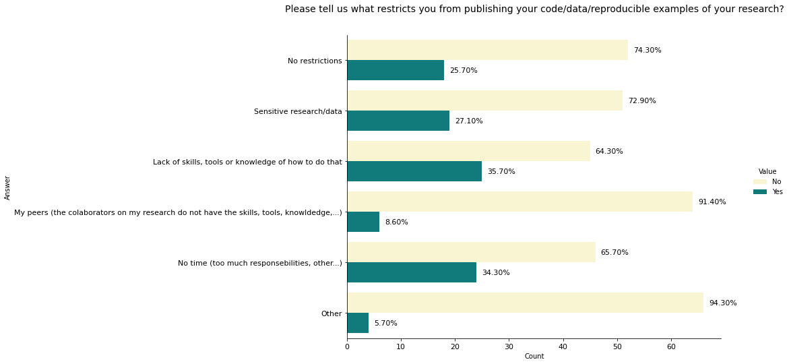
    


```python
list(resu['perc'])
```


    [74.3, 25.7, 72.9, 27.1, 64.3, 35.7, 91.4, 8.6, 65.7, 34.3, 94.3, 5.7]


```python
# cheat way how to export images at once
!jupyter nbconvert --to markdown *.ipynb
```

    [NbConvertApp] Converting notebook reproducibility.ipynb to markdown
    [NbConvertApp] Support files will be in reproducibility_files\
    [NbConvertApp] Making directory reproducibility_files
    [NbConvertApp] Making directory reproducibility_files
    [NbConvertApp] Making directory reproducibility_files
    [NbConvertApp] Making directory reproducibility_files
    [NbConvertApp] Making directory reproducibility_files
    [NbConvertApp] Making directory reproducibility_files
    [NbConvertApp] Making directory reproducibility_files
    [NbConvertApp] Making directory reproducibility_files
    [NbConvertApp] Making directory reproducibility_files
    [NbConvertApp] Making directory reproducibility_files
    [NbConvertApp] Making directory reproducibility_files
    [NbConvertApp] Writing 43734 bytes to reproducibility.md
    


```python

```
